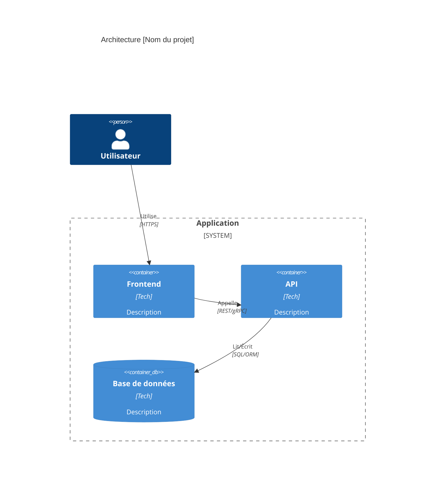
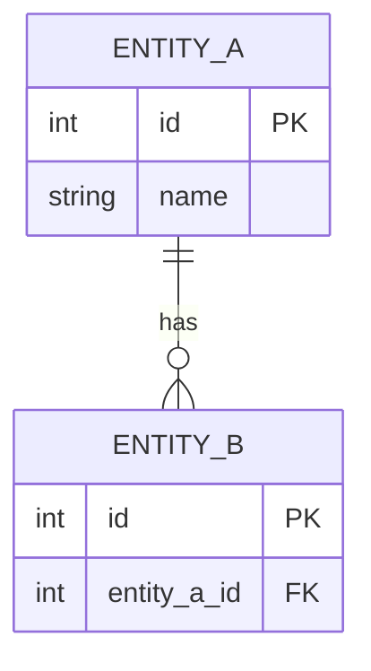

<!-- INSTRUCTIONS CLAUDE
Ce fichier est un TEMPLATE de référence. Il fait partie du dossier Modèles
ajouté comme contexte permanent à tous les projets.

RÈGLES :
- NE JAMAIS modifier ce fichier. Produire un fichier instancié dans le repo
  du projet : docs/specs/[domaine].md (un fichier par domaine) + docs/specs/_index.md
- Si ce fichier n'est pas dans ton contexte, DEMANDE à l'utilisateur de te
  le fournir avant de produire quoi que ce soit.
- Instancier les sections selon le profil sécurité choisi (minimal/standard/renforcé).
- Les sections marquées [EXT-SN] sont des extensions sécurité à activer selon le profil.

PROFILS SÉCURITÉ :
- minimal : socle §3.7 uniquement
- standard : socle + EXT-S1 + EXT-S2 + EXT-S3
- renforcé : socle + EXT-S1 à EXT-S5
-->

# Spécifications & Cadrage — [Nom du projet]

**Version :** 0.1
**Date :** YYYY-MM-DD
**Statut :** Brouillon | Validé
**Profil sécurité :** minimal | standard | renforcé
**Interface utilisateur :** Oui | Non
**Archi active :** aucune | `docs/agent/archis/ARCHI-...md`

> **Références normatives :** ISO/IEC/IEEE 12207 · ISO/IEC 25010 · ISO/IEC 27034

---

## Historique

| Version | Date | Auteur | Modifications |
|---|---|---|---|
| 0.1 | YYYY-MM-DD | | Création initiale |

---

# 1 — CADRAGE

## 1.1 Contexte & Objectifs

**Problème :**
> 2-4 phrases.

**Objectifs mesurables :**
1. ...
2. ...

## 1.2 Périmètre

**Inclus :** ...
**Exclus :** ...

## 1.3 Contraintes

| Type | Description |
|---|---|
| Technique | Stack, compatibilité, hébergement |
| Calendaire | Échéances |
| Réglementaire | RGPD, NIS2, normes sectorielles |

## 1.4 Hypothèses & Risques

| Risque | Probabilité | Impact | Mitigation |
|---|---|---|---|
| ... | F/M/É | F/M/É | ... |

## 1.5 Qualité (ISO 25010)

> Ne garder que les lignes pertinentes.

| Caractéristique | Objectif | Priorité |
|---|---|---|
| Performance — temps réponse | p95 < X ms sous Y users | Must/Should |
| Fiabilité — disponibilité | SLA ≥ X% | Must/Should |
| Fiabilité — reprise | RTO < X, RPO < X | Must/Should |
| Sécurité — confidentialité | Données [cat.] restreintes aux rôles [liste] | Must |
| Maintenabilité — testabilité | Couverture > X% logique métier | Should |
| Compatibilité — interopérabilité | Compatible [systèmes tiers] | Must/Should |

---

# 2 — SPÉCIFICATIONS FONCTIONNELLES

## 2.1 Vue d'ensemble

> Qui utilise le produit, pour quoi, dans quel contexte. 3-5 phrases.

## 2.2 Acteurs

| Acteur | Rôle |
|---|---|
| ... | ... |

## 2.3 Exigences non-fonctionnelles

| ID | Caractéristique | Cible mesurable | Ref. recette |
|---|---|---|---|
| ENF-001 | Performance — temps réponse | p95 < 500 ms sous 50 users | RT-PERF-001 |
| ENF-002 | Fiabilité — disponibilité | ≥ 99,5% | RT-FIAB-001 |
| ... | ... | ... | ... |

## 2.4 User Stories

### US-001 — [Titre]

**En tant que** [acteur], **je veux** [action] **afin de** [bénéfice].

**Critères d'acceptation :**
```gherkin
Given  [contexte]
When   [action]
Then   [résultat]
```

**Priorité :** Must / Should / Could / Won't

---

## 2.5 Règles de gestion

| ID | Règle | Priorité | Source |
|---|---|---|---|
| RG-001 | ... | Must | US-XXX |

## 2.6 Flux utilisateur

> Diagramme Mermaid pour flux non triviaux uniquement.

## 2.7 Hors périmètre fonctionnel

> Ce qui ne sera PAS implémenté dans cette version.

---

# 3 — SPÉCIFICATIONS TECHNIQUES

## 3.1 Architecture (C4 Container)



## 3.2 Stack technique

| Composant | Technologie | Justification |
|---|---|---|
| Backend | | |
| Frontend | | |
| Base de données | | |
| Auth | | |
| Hébergement | | |
| CI/CD | | |

### Références d'architecture

Lister les fichiers `docs/agent/archis/*.md` normatifs pour ce projet et les
sections spécialisées à respecter. Si la stack est Expo/Prisma, référencer au
minimum :

- `docs/agent/archis/ARCHI-EXPO-PRISMA.md` — ordre de lecture et règles globales.
- `docs/agent/archis/ARCHI-EXPO-PRISMA-REPO.md` — monorepo `packages/app` + `packages/api`.
- `docs/agent/archis/ARCHI-EXPO-PRISMA-BACKEND.md` — Express, Zod, modules API.
- `docs/agent/archis/ARCHI-EXPO-PRISMA-AUTH.md` — auth mobile-ready.
- `docs/agent/archis/ARCHI-EXPO-PRISMA-PRISMA.md` — singleton, migrations, transactions.
- `docs/agent/archis/ARCHI-EXPO-PRISMA-FRONTEND.md` — client API et Expo Router.
- `docs/agent/archis/ARCHI-EXPO-PRISMA-DOCKER.md` — services locaux.
- `docs/agent/archis/ARCHI-EXPO-PRISMA-CICD.md` — scripts, CI/CD, PM2.

Ne jamais référencer le document d'audit migration dans une spec ordinaire.

## 3.3 Modèle de données



> Une fois §3.2 et §3.3 validés, si le projet a une interface utilisateur,
> lancer la phase UI Design via `TEMPLATE-UI-DESIGN.md` avant de générer
> le plan des Axes. Le livrable sera `docs/ui-design.md`.

## 3.4 Contrats d'API

### [Ressource]

| Méthode | Route | Description | Réponse |
|---|---|---|---|
| GET | `/api/resource` | Liste paginée | `200 Resource[]` |
| POST | `/api/resource` | Création | `201 Resource` |

## 3.5 Séquences critiques

> Diagrammes de séquence Mermaid uniquement pour les flux complexes.

## 3.6 Qualité détaillée (ISO 25010)

| Exigence | Cible | Conditions | Ref. ENF |
|---|---|---|---|
| Temps réponse API p95 | < 200 ms | Charge nominale | ENF-001 |
| Disponibilité | ≥ 99,5% | Health check + restart | ENF-002 |
| Tests unitaires | > 80% logique métier | CI | ENF-00X |

## 3.7 Sécurité — Socle (toujours applicable)

| Domaine | Exigence |
|---|---|
| Auth | [OAuth2/JWT/API Key] — durée tokens, verrouillage après N échecs |
| Autorisation | [RBAC/ABAC] — rôles : [liste] |
| Chiffrement transit | TLS 1.2+ obligatoire |
| Validation entrées | Stricte côté serveur (schéma, type, longueur) |
| Injection SQL | ORM + requêtes paramétrées uniquement |
| Secrets | [Vault/env vars via CI] — jamais en clair |
| Headers HTTP | HSTS, X-Content-Type-Options, X-Frame-Options, CSP |

## 3.8 Stratégie de tests

| Niveau | Outil | Cible |
|---|---|---|
| Unitaire | [xUnit/Vitest/pytest] | Logique métier > 80% |
| Intégration | | Endpoints critiques |
| E2E | | Flux principaux |

---

# 4 — TRAÇABILITÉ

## 4.1 Matrice exigences → tests

| ID | Description | Scénario recette | Statut |
|---|---|---|---|
| US-001 | [Titre] | RT-001 | — |
| ENF-001 | Performance | RT-PERF-001 | — |

## 4.2 Points ouverts

| ID | Question | Responsable | Échéance |
|---|---|---|---|
| PO-001 | ... | ... | ... |

## 4.3 Go / No-go

**Décision :** Go ☐ No-go ☐
**Commentaire :**

---

# EXTENSIONS SÉCURITÉ

> Activer selon le profil sécurité choisi dans l'en-tête du document.
> minimal = aucune extension. standard = EXT-S1 + S2 + S3. renforcé = toutes.

## EXT-S1 — Classification des données [standard+]

| Catégorie | Exemples | Sensibilité | Contrôles |
|---|---|---|---|
| Données personnelles | Nom, email | Restreint | Chiffrement repos+transit, RBAC, audit log |
| Données métier | | Interne | RBAC |
| Secrets | Mots de passe, API keys | Critique | Vault, jamais en clair |

## EXT-S2 — Journalisation sécurité [standard+]

| Événement | Niveau | Rétention |
|---|---|---|
| Auth réussie/échouée | INFO/WARN | X mois |
| Accès refusé (403) | WARN | X mois |
| Modif entités critiques | INFO | X mois |

## EXT-S3 — Chiffrement repos [standard+]

Mécanisme : [AES-256 / TDE] pour [catégories].
Rétention : [durée par catégorie].
Effacement RGPD : [mécanisme suppression/anonymisation].

## EXT-S4 — Modèle de menaces STRIDE [renforcé]

| Menace | Composant | Contrôle |
|---|---|---|
| Spoofing | Auth | OAuth2 PKCE / MFA / verrouillage |
| Tampering | API/DB | Validation entrées, HMAC |
| Repudiation | Actions sensibles | Audit log horodaté |
| Info Disclosure | API/Logs | Pas de stack trace prod |
| DoS | API publique | Rate limiting, timeout, circuit breaker |
| Elevation | Contrôle accès | RBAC strict, tests autorisation |

## EXT-S5 — Tests sécurité avancés [renforcé]

| Type | Outil | Cible |
|---|---|---|
| SAST | Semgrep/SonarQube | 0 issue critique en CI |
| DAST | OWASP ZAP | Staging avant livraison |
| Dépendances | Dependabot/OWASP DC | 0 CVE critique non traité |
| Supply chain | Images Docker officielles, pas de :latest en prod | |
