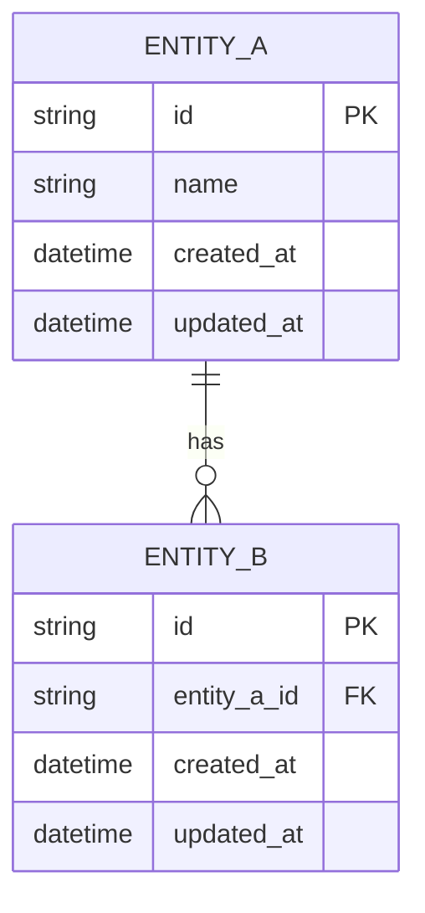

<!-- INSTRUCTIONS CLAUDE
Template de référence. NE JAMAIS modifier.
Produire : docs/data-model.md dans le repo du projet.

RÈGLES :
- Source de vérité du modèle de données — actif sur toute la durée du projet.
- Mettre à jour dans la même session que toute modification du schéma.
- Ne pas attendre /finalise pour mettre à jour ce fichier.
- Lire ce fichier uniquement si le claude.md de l'Axe le référence explicitement.
-->

# Modèle de données — [Nom du projet]

**Dernière mise à jour :** YYYY-MM-DD — Axe N
**Références architecture :** `docs/agent/archis/ARCHI-...md`

---

## Références d'architecture

- `docs/agent/archis/[archi].md §...` — règles de persistance applicables.
- Pour Expo/Prisma : `docs/agent/archis/ARCHI-EXPO-PRISMA-PRISMA.md`
  est obligatoire pour l'emplacement Prisma, le singleton, les migrations,
  les transactions, la pagination, les seeds et les tests DB.

## Diagramme ERD

---

## Invariants par entité

> Règles métier qui ne doivent jamais être violées, indépendamment de l'implémentation.
> Si une règle est complexe, pointer vers docs/algos/ plutôt que l'expliquer ici.

### [EntitéA]

- ...

### [EntitéB]

- ...

---

## Conventions

- IDs : `cuid()` | `uuid()` | séquentiel — préciser le choix du projet
- Timestamps : `created_at`, `updated_at` sur toutes les tables
- Soft delete : `deleted_at` nullable sur [liste des entités concernées]
- FK : `[table_singulier]_id`
- Prisma : ne jamais instancier `PrismaClient` hors du singleton documenté par
  l'archi active ; toute modification de schéma implique une migration versionnée.

---

## Historique des évolutions

| Axe | Date | Modification |
|---|---|---|
| Axe 1 | YYYY-MM-DD | Création initiale |
