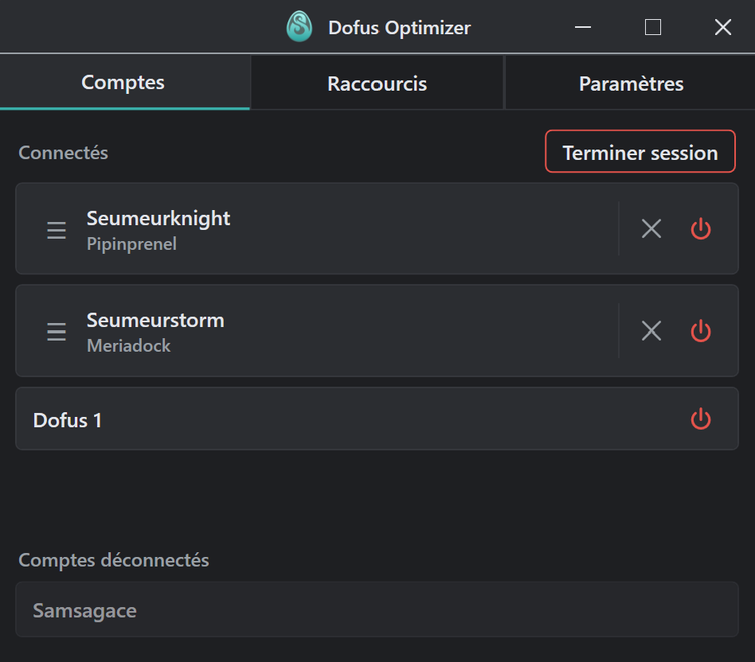
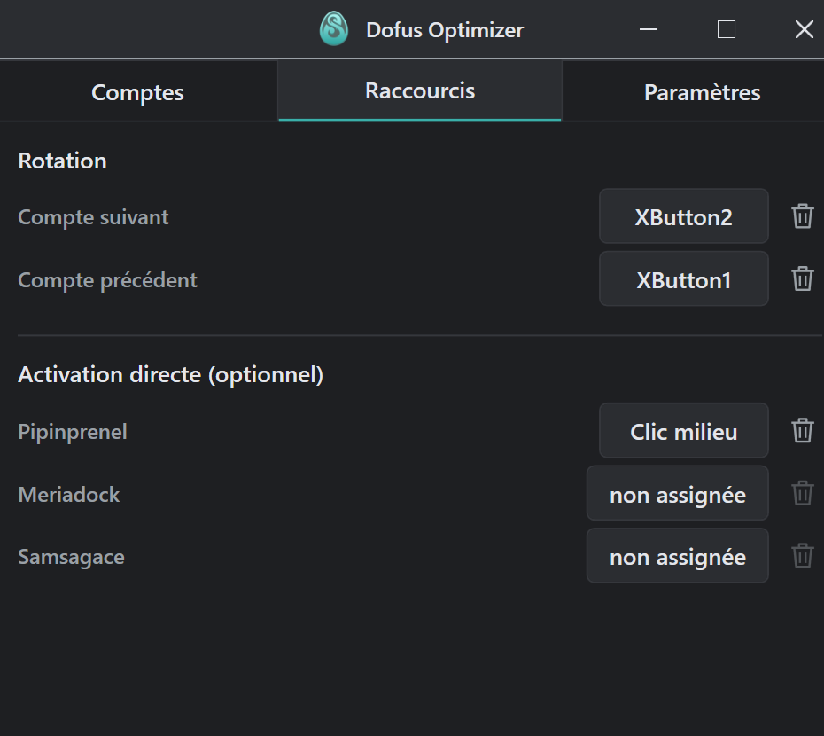

# Dofus Optimizer

Application 100% vivbecodée de bascule rapide entre plusieurs clients Dofus 
pour faciliter le multi-compte.
Finis les ALT+TAB, pilote tes clients Dofus avec des raccourcis personnalisés 
et optimise ton exppérience de jeu.

**Version courante : 1.5.1** — 2026-10-07


## Fonctionnalités

<p align="center">
  
</p>

Détection des clients Dofus ouverts et des personnages connectés en temps réel<br>
Drag & drop pour organiser de l'ordre des comptes<br>
Enregistre manuellement les personnages par compte pour conserver tes raccourcis

<p align="center">
  
</p>

2 types de raccourcis :<br>
Raccourcis de rotation pour accéder au prochain compte dans l'ordre déterminé<br>
Raccourcis directs pour accéder au compte voulu

Désigne un compte chef du groupe d'un clic sur la couronne dans les Réglages<br>
Depuis l'onglet Comptes, copie en un clic la commande `/invite` de tous les autres personnages connectés

## Installation

1. Télécharger `Setup.exe` depuis la [dernière release](https://github.com/seumeurhitmachine/dofusOptimizer/releases).
2. Lancer `Setup.exe`. L'application s'installe et se mettra **à jour automatiquement** à la sortie d'une nouvelle version.

> **Avertissement Windows au premier lancement.** L'application n'est pas signée :
> Windows SmartScreen peut afficher « Windows a protégé votre ordinateur ». Cliquer sur
> **« Informations complémentaires »** puis **« Exécuter quand même »**. 

## Prérequis

- Windows 10/11 (x64).

## Pour modifier l'application

```powershell
Vérifie l'installation de [.NET SDK 10](https://dotnet.microsoft.com/)

# Lancer en développement
dotnet run --project src/App/App.csproj

# Itérer sur l'UI avec rechargement à chaud du XAML
dotnet watch --project src/App/App.csproj

# Lancer les tests
dotnet test tests/App.Tests/App.Tests.csproj

# Publier l'exécutable autonome (single-file) → DofusOptimizer.exe
dotnet publish src/App -c Release -r win-x64
```

La configuration est stockée dans
`%APPDATA%\DofusSwitcher\config.json`.

## Disclaimer & Licence

Ankama n'approuve jamais aucune application tierce pour Dofus et les risques liés à son
utilisation n'engage pas la responsabilité des développeurs.

A savoir que l'application n'interagit jamais avec le processus du jeu : elle s'appuie
exclusivement sur la gestion native des fenêtres Windows.

Propriété de Mathias GROSZ - Usage privé.
