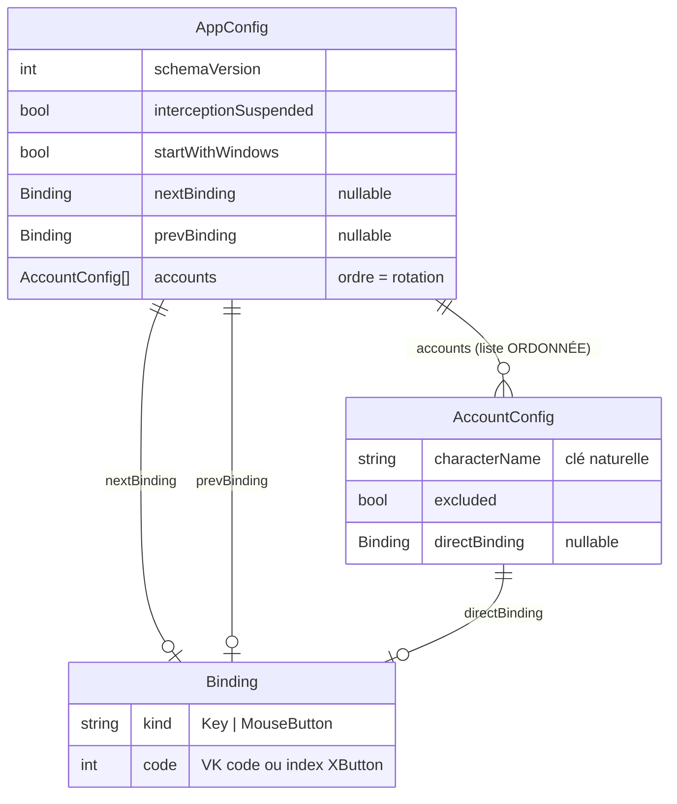

# Modèle de données — Dofus Window Switcher

**Dernière mise à jour :** 2026-09-24 — pré-Axe 1 (init)
**Références architecture :** `docs/agent/archis/ARCHI-DOTNET-WPF.md §Persistance`

> Le « modèle de données » de cet outil est le **schéma du fichier de
> configuration JSON local** — il n'y a pas de base de données relationnelle.
> Ce fichier supersède l'esquisse ERD de `docs/specs/persistence.md`.

---

## Références d'architecture

- `docs/agent/archis/ARCHI-DOTNET-WPF.md §Persistance` — `System.Text.Json`
  source-gen (`AppJsonContext`), écriture atomique, reprise sur corruption.
- Emplacement : `%APPDATA%\DofusSwitcher\config.json` (JSON indenté, camelCase).

## Diagramme ERD (structure logique du JSON)

`Binding` est un **value object** (pas d'identité propre) : sérialisé inline
partout où il apparaît.

---

## Invariants par entité

> Règles qui ne doivent jamais être violées, indépendamment de l'implémentation.
> La rotation cyclique (saut des absents/exclus) sera détaillée dans
> `docs/algos/rotation.md` à l'Axe correspondant (`[ALGO]`).

### AppConfig

- `schemaVersion ≥ 1`. Au chargement : version **inférieure** → migration montante ;
  version **supérieure** (config d'une app plus récente) → traitée comme illisible
  → backup + config par défaut (jamais de perte silencieuse). Voir §Conventions.
- **Unicité globale des entrées** (EF-08) : une même `Binding` ne peut pas être
  partagée par deux actions parmi `nextBinding`, `prevBinding` et les
  `directBinding` des comptes. Un conflit est refusé à l'enregistrement (UI) ; le
  fichier persisté est toujours sans conflit.
- `nextBinding` et `prevBinding` sont indépendants et optionnels ; par défaut
  `nextBinding = MouseButton XButton2`, `prevBinding = MouseButton XButton1`.
- `accounts` : liste **ordonnée** ; l'ordre de la liste **est** l'ordre de rotation
  (source unique — pas de champ `order` séparé, pour éviter deux vérités).
- `interceptionSuspended = true` ⇒ le hook transmet toujours nativement (RG-T03) ;
  état persistant.

### AccountConfig

- `characterName` **non vide et unique** dans `accounts` : c'est la **clé
  naturelle** (identité stable), cohérente avec la détection par titre (RG-D01) et
  la conservation hors ligne (EP-03).
- Un compte est **conservé même absent** : la présence en config est indépendante
  de l'existence d'une fenêtre (état `connecté/absent` calculé au runtime, **non
  persisté**).
- `excluded = true` ⇒ retiré de la rotation mais conservé et réactivable (EF-09).
- `directBinding` optionnel ; s'il est présent, soumis à l'unicité globale.

### Binding

- Représente **une seule** entrée physique — une touche **ou** un bouton souris.
  Aucune combinaison / modificateur (D-01).
- `kind ∈ {Key, MouseButton}`. `code` : Virtual-Key code (`Key`) ou index de bouton
  X (`MouseButton`, ex. XButton1/2). Deux `Binding` sont égaux ssi `kind` **et**
  `code` égaux (base de la détection de conflit).

---

## Conventions

- **Identité** : clé naturelle `characterName` — pas d'ID de substitution
  (`uuid`/`cuid`) : outil local, pas de base relationnelle.
- **Pas de timestamps, soft-delete ni FK** relationnels : structure de document.
- **Ordre** : porté par l'ordre de la liste `accounts` (unique source de vérité).
- **Sérialisation** : `System.Text.Json` source-gen (`AppJsonContext`), camelCase,
  indenté (lisible — EP-01). Enums sérialisés en **chaînes** (`"Key"`/`"MouseButton"`)
  pour la lisibilité et la stabilité. Écriture **atomique** (temp + `File.Move`),
  autosave **débouncé** (archi §Persistance, §Threading).
- **Versioning / migration** (remplace les migrations SQL) : toute évolution de
  schéma **incrémente `schemaVersion`** et fournit une fonction de migration
  montante idempotente ; ne jamais casser une config existante. `schemaVersion`
  initial = `1`.
- **Runtime vs persisté** : l'état `connecté/absent` et le handle de fenêtre
  (`HWND`) sont **calculés au runtime**, jamais écrits dans le fichier.

---

## Historique des évolutions

| Axe | Date | Modification |
|---|---|---|
| pré-Axe 1 | 2026-09-24 | Création initiale (schemaVersion 1) |
