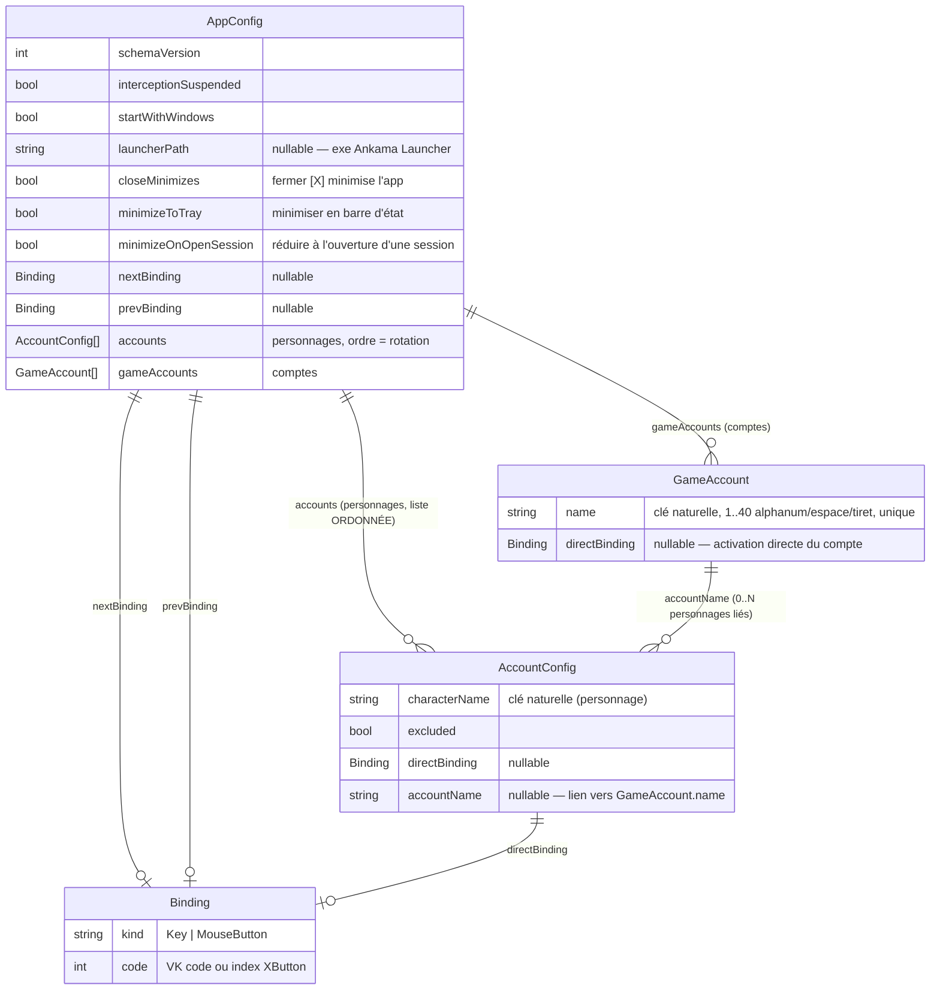

# Modèle de données — Dofus Window Switcher

**Dernière mise à jour :** 2026-09-26 — Axe 11 (champ additif `minimizeOnOpenSession` ; clients sans personnage runtime-only)
**Références architecture :** `docs/agent/archis/ARCHI-DOTNET-WPF.md §Persistance`

> Le « modèle de données » de cet outil est le **schéma du fichier de
> configuration JSON local** — il n'y a pas de base de données relationnelle.
> Ce fichier supersède l'esquisse ERD de `docs/specs/persistence.md`.

---

## Références d'architecture

- `docs/agent/archis/ARCHI-DOTNET-WPF.md §Persistance` — `System.Text.Json`
  source-gen (`AppJsonContext`), écriture atomique, reprise sur corruption.
- Emplacement : `%APPDATA%\DofusSwitcher\config.json` (JSON indenté, camelCase).

## Diagramme ERD (structure logique du JSON)

> **Terminologie (v2)** : `AccountConfig` modélise un **personnage** (nom de type historique v1,
> conservé pour la compat JSON `accounts`). L'entité **compte** est `GameAccount`. Le lien
> personnage→compte est le champ nullable `accountName`.

`Binding` est un **value object** (pas d'identité propre) : sérialisé inline
partout où il apparaît.

---

## Invariants par entité

> Règles qui ne doivent jamais être violées, indépendamment de l'implémentation.
> La rotation cyclique (saut des absents/exclus) sera détaillée dans
> `docs/algos/rotation.md` à l'Axe correspondant (`[ALGO]`).

### AppConfig

- `schemaVersion ≥ 1`. Au chargement : version **inférieure** → migration montante ;
  version **supérieure** (config d'une app plus récente) → traitée comme illisible
  → backup + config par défaut (jamais de perte silencieuse). Voir §Conventions.
- **Unicité globale des entrées** (EF-08) : une même `Binding` ne peut pas être
  partagée par deux actions parmi `nextBinding`, `prevBinding` et les
  `directBinding` des comptes. Un conflit est refusé à l'enregistrement (UI) ; le
  fichier persisté est toujours sans conflit.
- `nextBinding` et `prevBinding` sont indépendants et optionnels ; par défaut
  `nextBinding = MouseButton XButton2`, `prevBinding = MouseButton XButton1`.
- `accounts` : liste **ordonnée** ; l'ordre de la liste **est** l'ordre de rotation
  (source unique — pas de champ `order` séparé, pour éviter deux vérités).
- `interceptionSuspended = true` ⇒ le hook transmet toujours nativement (RG-T03) ;
  état persistant.
- `launcherPath` optionnel (Axe 9) : chemin de l'exécutable Ankama Launcher pour « Ouvrir une session ».
  Vide/`null` ⇒ auto-détection (`%LOCALAPPDATA%\Programs\Ankama Launcher\…` + registre `App Paths`) ; s'il est
  renseigné il **prime**. Aucun chemin utilisable ⇒ bouton d'ouverture masqué.
- `closeMinimizes` (Axe 9, **défaut `true`**) : fermer la fenêtre [X] **minimise** l'app au lieu de quitter.
  Absent d'une config < v3 ⇒ **forcé `true`** à la migration (préserve le comportement tray historique).
- `minimizeToTray` (Axe 9, défaut `false`) : minimiser masque la fenêtre en **barre d'état** (zone de
  notification) plutôt qu'en barre des tâches. Les deux actifs ⇒ [X] minimise en barre d'état.
- `minimizeOnOpenSession` (Axe 11, défaut `false`) : après « Ouvrir une session », l'app se **minimise**
  (selon `minimizeToTray`). Champ **additif** (init hors constructeur positionnel) : absent ⇒ `false`,
  **aucun bump de `schemaVersion`** ni migration (comme `launcherPath`).

### AccountConfig (personnage)

- `characterName` **non vide et unique** dans `accounts` : c'est la **clé
  naturelle** (identité stable), cohérente avec la détection par titre (RG-D01) et
  la conservation hors ligne (EP-03).
- Un personnage est **conservé même absent** : la présence en config est indépendante
  de l'existence d'une fenêtre (état `connecté/absent` calculé au runtime, **non
  persisté**).
- `excluded = true` ⇒ retiré de la rotation mais conservé et réactivable (EF-09). Vaut aussi pour un
  personnage **sans compte** (Axe 10) : la rotation intègre tout personnage connecté, lié ou non.
- `directBinding` optionnel ; s'il est présent, soumis à l'unicité globale. **Actif pour les personnages
  non liés** (`accountName = null`, Axe 10) : porte leur activation directe. Pour un personnage lié,
  l'activation directe est portée par le compte (`GameAccount.DirectBinding`, [DT-025]) ; au moment du lien,
  un `directBinding` de personnage est **transféré au compte** s'il n'en a pas, sinon effacé ([DT-029]).
- `accountName` optionnel : nom d'un `GameAccount` existant (RG-C02) ou `null` (non lié).
  Lien établi **manuellement** (RG-C06). Ne remet pas en cause l'ordre de rotation (RG-C05).

### GameAccount (compte)

- `name` **non vide, ≤ 40, `^[A-Za-z0-9 -]$`** après `Trim`, **unique** dans `gameAccounts`
  (comparaison **insensible à la casse**) — RG-C01.
- Regroupe **0..N** personnages via `AccountConfig.accountName` ; au plus **un** personnage
  lié connecté à la fois (RG-C02/C03).
- `directBinding` optionnel : activation directe **portée par le compte** (Axe 8). À l'appui, active le
  personnage lié **actuellement connecté** du compte (résolu au runtime). Soumis à l'unicité globale.
- **Aucun** état runtime : « compte connecté » = a un personnage lié actuellement détecté.
- Supprimer un compte **supprime** les personnages liés (leurs `AccountConfig`), sans
  confirmation (RG-C04) ; un personnage lié encore connecté réapparaît non lié (runtime).

### Binding

- Représente **une seule** entrée physique — une touche **ou** un bouton souris.
  Aucune combinaison / modificateur (D-01).
- `kind ∈ {Key, MouseButton}`. Deux `Binding` sont égaux ssi `kind` **et** `code`
  égaux (base de la détection de conflit).
- `code` selon `kind` :
  - `Key` : Virtual-Key code Windows (ex. `0x41` = A, `0x70` = F1).
  - `MouseButton` : code de bouton souris. **Toute la souris est acceptée** (pas de
    whitelist) : `1` = XButton1, `2` = XButton2 (conservent les défauts
    `précédent`/`suivant`), `3` = bouton gauche, `4` = bouton droit, `5` = bouton
    milieu. Encodage centralisé dans `src/App/Models/InputCapture.cs`.

---

## Conventions

- **Identité** : clé naturelle `characterName` — pas d'ID de substitution
  (`uuid`/`cuid`) : outil local, pas de base relationnelle.
- **Pas de timestamps, soft-delete ni FK** relationnels : structure de document.
- **Ordre** : porté par l'ordre de la liste `accounts` (unique source de vérité).
- **Sérialisation** : `System.Text.Json` source-gen (`AppJsonContext`), camelCase,
  indenté (lisible — EP-01). Enums sérialisés en **chaînes** (`"Key"`/`"MouseButton"`)
  pour la lisibilité et la stabilité. Écriture **atomique** (temp + `File.Move`),
  autosave **débouncé** (archi §Persistance, §Threading).
- **Versioning / migration** (remplace les migrations SQL) : toute évolution de
  schéma **incrémente `schemaVersion`** et fournit une fonction de migration
  montante idempotente ; ne jamais casser une config existante. `schemaVersion`
  initial = `1`.
- **Runtime vs persisté** : l'état `connecté/absent` et le handle de fenêtre
  (`HWND`) sont **calculés au runtime**, jamais écrits dans le fichier.
- **Clients sans personnage** (Axe 11) : un client DOFUS connecté sans personnage (écran de sélection
  « Dofus <version> - Release ») est **purement runtime** — identité dérivée du handle, affiché « Dofus N »,
  fermable et inclus dans la rotation, mais **jamais** dans `accounts` (pas de nom stable) : ni compte, ni
  raccourci, ni exclusion/ordre persistés. Il n'existe donc pas dans ce modèle de données.

---

## Historique des évolutions

| Axe | Date | Modification |
|---|---|---|
| pré-Axe 1 | 2026-09-24 | Création initiale (schemaVersion 1) |
| Axe 2 | 2026-09-24 | Matérialisation du schéma en code (`Binding`/`AccountConfig`/`AppConfig`, `AppJsonContext`, `JsonConfigStore`). Aucun champ modifié : schemaVersion reste 1. Invariant d'unicité globale porté par `AppConfig.HasBindingConflicts()`. |
| Axe 5 | 2026-09-24 | Encodage `Binding.Code` pour `MouseButton` étendu à toute la souris (gauche=3, droit=4, milieu=5 ; XButton1/2=1/2 inchangés). Aucun champ ni schemaVersion modifié (valeurs de `code` élargies). Encodage/formatage centralisés dans `InputCapture`. |
| Axe 8 | 2026-09-24 | **schemaVersion 1 → 2**. Nouvelle entité `GameAccount` (compte) dans `appConfig.gameAccounts` ; lien nullable `accountConfig.accountName` (personnage→compte). Migration montante additive (v1 sans `gameAccounts` → liste vide, personnages non liés). Terminologie clarifiée : `AccountConfig` = personnage. |
| Axe 9 | 2026-09-25 | **schemaVersion 2 → 3**. Cycle de session/vie : `appConfig.launcherPath` (nullable, chemin Ankama Launcher), `closeMinimizes` (défaut `true`), `minimizeToTray` (défaut `false`). Migration montante : configs < v3 → `closeMinimizes` forcé `true` (préserve le comportement tray). Aucune entité modifiée. |
| Axe 10 | 2026-09-25 | **Aucun changement de schéma** (schemaVersion inchangée). Réactivation comportementale de `accountConfig.directBinding` pour les personnages **non liés** (activation directe portée par le personnage) ; transfert au compte au moment du lien ([DT-029]). Déjà couvert par l'unicité globale (`AllBindings`). |
| Axe 11 | 2026-09-26 | **Aucun bump de `schemaVersion`** (reste 3). Champ additif `appConfig.minimizeOnOpenSession` (défaut `false`, source-gen, sans migration — comme `launcherPath`). Clients DOFUS **sans personnage** = participants **runtime-only** de la rotation (identité=handle, « Dofus N ») : jamais persistés, hors modèle ([DT-030]). |
