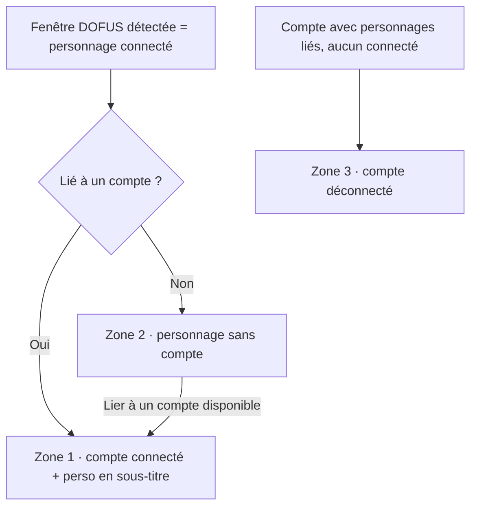
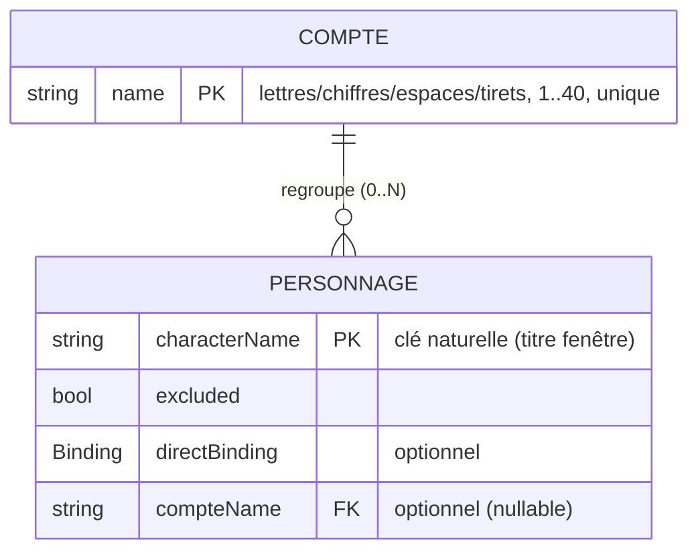

# Spécifications & Cadrage — Dofus Optimizer · Comptes v2

**Version :** 0.1
**Date :** 2026-09-24
**Statut :** Brouillon
**Profil sécurité :** minimal
**Interface utilisateur :** Oui
**Archi active :** `docs/agent/archis/ARCHI-DOTNET-WPF.md`

> Spec d'évolution (post-v1.0.0). Introduit la distinction **Compte / Personnage**.
> Ne remplace pas les specs initiales (archivées) : les complète sur le domaine comptes.

---

## Historique

| Version | Date | Auteur | Modifications |
|---|---|---|---|
| 0.1 | 2026-09-24 | Mathias | Création — modèle Compte↔Personnage, CRUD comptes, onglet Comptes en 3 zones |

---

# 1 — CADRAGE

## 1.1 Contexte & Objectifs

**Problème :** ce que la v1 appelait « compte » est en réalité un **personnage**. Or un
compte DOFUS regroupe plusieurs personnages (un seul connecté à la fois). Sans la notion
de compte, impossible de savoir à quel compte appartient le personnage connecté ni de
préparer la modulation d'équipes.

**Objectifs :**
1. Modéliser explicitement le **Compte** (regroupant N personnages) distinct du **Personnage**.
2. Permettre le **repérage** du compte d'appartenance du personnage connecté.
3. Gérer les comptes (créer / renommer / supprimer) et lier les personnages aux comptes.

## 1.2 Périmètre

**Inclus :** entité Compte + lien Personnage→Compte ; CRUD des comptes (onglet Réglages) ;
liaison manuelle d'un personnage connecté à un compte ; onglet Comptes réorganisé en 3 zones ;
migration des données v1.

**Exclus :** modification du cœur de rotation/bascule (reste sur les personnages/fenêtres —
décision de cadrage) ; auto-détection du compte (impossible sous C-02) ; gestion d'équipes.

## 1.3 Contraintes

| Type | Description |
|---|---|
| Technique | .NET 10 / WPF, MVVM manuel, persistance JSON `%APPDATA%` (réutilise l'existant) |
| Métier | Détection **exclusivement** via API fenêtres `user32` (C-02) — pas d'inspection process |
| Compatibilité | Migration ascendante de la config v1 sans perte des réglages personnage |

## 1.4 Hypothèses & Risques

| Risque | Prob. | Impact | Mitigation |
|---|---|---|---|
| Impossible de déduire le compte d'un personnage automatiquement | Certaine | M | Liaison **manuelle** persistée (RG-C06) |
| Perte de réglages à la suppression d'un compte | Certaine | F | Comportement **assumé** (RG-C04) ; pas de confirmation demandée |
| Migration v1→v2 corrompt la config | F | É | Bump `schemaVersion` + réutilise reprise sur corruption (Axe 2) + tests round-trip |

## 1.5 Qualité (ISO 25010)

| Caractéristique | Objectif | Priorité |
|---|---|---|
| Maintenabilité — testabilité | Logique de partition (3 zones) + validation nom + migration testées sans WPF | Must |
| Compatibilité — reprise config v1 | Config v1 chargée sans perte des réglages personnage | Must |

---

# 2 — SPÉCIFICATIONS FONCTIONNELLES

## 2.1 Vue d'ensemble

L'utilisateur multi-comptes déclare ses **comptes** (unité persistante d'organisation) et
**lie** ses personnages connectés au compte correspondant. L'onglet Comptes reflète en temps
réel l'état par compte et par personnage ; la bascule entre fenêtres reste inchangée.

## 2.2 Acteurs

| Acteur | Rôle |
|---|---|
| Utilisateur multi-comptes | Crée/renomme/supprime des comptes, lie ses personnages, bascule entre fenêtres |

## 2.3 Exigences non-fonctionnelles

| ID | Caractéristique | Cible mesurable | Ref. recette |
|---|---|---|---|
| ENF-C01 | Maintenabilité — testabilité | Partition 3 zones, validation nom, migration : couvertes par tests unitaires | RT-C-TESTS |
| ENF-C02 | Compatibilité — migration | Chargement d'une config v1 → personnages préservés, non liés | RT-C-MIGR |

## 2.4 User Stories

### US-C01 — Créer un compte
**En tant qu'** utilisateur, **je veux** créer un compte (nom) dans les Réglages **afin de** regrouper mes personnages.
```gherkin
Given l'onglet Réglages
When je saisis un nom (lettres, chiffres, espaces, tirets ; ≤ 40) unique et valide
Then le compte est créé, persisté, et disponible pour la liaison
```
**Priorité :** Must

### US-C02 — Renommer un compte
```gherkin
Given un compte existant
When je le renomme avec un nom valide et unique
Then le nom est mis à jour et les personnages liés le suivent
```
**Priorité :** Must

### US-C03 — Supprimer un compte
```gherkin
Given un compte avec des personnages liés
When je le supprime
Then le compte et ses personnages liés (réglages inclus) sont retirés, sans confirmation
```
**Priorité :** Must

### US-C04 — Zone 1 : comptes connectés
```gherkin
Given un compte dont un personnage lié est connecté
When j'ouvre l'onglet Comptes
Then le compte apparaît en zone 1 avec, en sous-titre plus petit, le nom du personnage connecté
```
**Priorité :** Must

### US-C05 — Zone 2 : personnages connectés sans compte + liaison
```gherkin
Given un personnage connecté non lié à un compte
When je choisis de le lier
Then seuls les comptes disponibles (sans personnage connecté) sont proposés (filtre préfait)
And après liaison le personnage/compte passe en zone 1
```
**Priorité :** Must

### US-C06 — Zone 3 : comptes déconnectés ayant des personnages liés
```gherkin
Given un compte dont aucun personnage lié n'est connecté mais qui a ≥ 1 personnage lié
When j'ouvre l'onglet Comptes
Then le compte apparaît en zone 3
```
**Priorité :** Must

## 2.5 Règles de gestion

| ID | Règle | Priorité | Source |
|---|---|---|---|
| RG-C01 | Nom de compte : `^[A-Za-z0-9 -]{1,40}$` (lettres, chiffres, espaces, tirets), non vide après `Trim`, unique (comparaison insensible à la casse) | Must | US-C01/02 |
| RG-C02 | Un personnage est lié à **0 ou 1** compte ; un compte regroupe **0..N** personnages | Must | US-C05 |
| RG-C03 | Au plus **un** personnage lié connecté par compte à un instant donné ; la liaison ne propose que les comptes sans personnage connecté | Must | US-C05 |
| RG-C04 | Supprimer un compte supprime les personnages liés et leurs réglages, **sans confirmation** (perte de données assumée) | Must | US-C03 |
| RG-C05 | La rotation/bascule reste inchangée : elle opère sur les personnages connectés (fenêtres), indépendamment des comptes | Must | Cadrage |
| RG-C06 | L'appartenance est établie **manuellement** (liaison) et persistée ; aucune auto-détection (C-02) | Must | Cadrage |
| RG-C07 | Migration v1→v2 : les « comptes » v1 deviennent des **personnages** conservés, non liés initialement, réglages (`excluded`, `directBinding`) préservés ; `schemaVersion` incrémenté | Must | Compat |

## 2.6 Flux utilisateur



## 2.7 Hors périmètre fonctionnel

Rotation par équipe/compte ; auto-détection du compte ; import de comptes depuis une source externe.

---

# 3 — SPÉCIFICATIONS TECHNIQUES

## 3.1 Architecture

Inchangée (application WPF mono-processus). Voir `docs/specs/overview.md §3.1`.

## 3.2 Stack technique

Inchangée. **Références d'architecture :** `docs/agent/archis/ARCHI-DOTNET-WPF.md`
(§MVVM manuel, §Persistance, §Threading). Zéro `PackageReference`.

## 3.3 Modèle de données



- **Runtime (non persisté)** : `connecté/absent` + `HWND` du personnage, comme en v1.
  Un **compte connecté** = compte ayant un personnage lié actuellement connecté.
- Persistance : réutilise `IConfigStore`/écriture atomique. Le modèle de données complet
  et la migration `schemaVersion` seront détaillés dans `docs/data-model.md` (ne pas dupliquer ici).

> Une fois §3.2 et §3.3 validés, l'application ayant une interface, prévoir un passage
> UI Design (`TEMPLATE-UI-DESIGN.md` / `docs/ui-design.md`) pour les 3 zones et le CRUD comptes.

## 3.5 Séquences critiques

Suppression d'un compte : retirer le compte → retirer les `PERSONNAGE` dont `compteName`
correspond → émettre `ConfigChanged` → autosave débouncé. Les personnages retirés encore
connectés réapparaissent en zone 2 (runtime only).

## 3.6 Qualité détaillée

| Exigence | Cible | Conditions | Ref. ENF |
|---|---|---|---|
| Partition 3 zones | Déterministe, pure, testée | Sans WPF | ENF-C01 |
| Migration v1→v2 | Round-trip sans perte | Config v1 réelle | ENF-C02 |

## 3.7 Sécurité — Socle

| Domaine | Exigence |
|---|---|
| Auth | Sans objet — application locale mono-utilisateur, sans authentification |
| Validation entrées | Nom de compte validé strictement (regex + longueur + unicité) avant persistance |
| Secrets | Sans objet — aucune donnée secrète ; config locale en clair (noms de comptes/personnages) |
| Intégrité fichier | Écriture atomique + reprise sur corruption (réutilise Axe 2) |
| Isolation process jeu | Aucune interaction avec le processus DOFUS (C-02) — API fenêtres `user32` seules |

## 3.8 Stratégie de tests

| Niveau | Outil | Cible |
|---|---|---|
| Unitaire | xUnit | Validation nom, partition 3 zones, cascade suppression, migration v1→v2 |

---

# 4 — TRAÇABILITÉ

## 4.1 Matrice exigences → tests

| ID | Description | Scénario recette | Statut |
|---|---|---|---|
| US-C01 | Créer un compte | RT-C01 | — |
| US-C02 | Renommer un compte | RT-C02 | — |
| US-C03 | Supprimer (cascade) | RT-C03 | — |
| US-C04 | Zone 1 comptes connectés | RT-C04 | — |
| US-C05 | Zone 2 + liaison (filtre préfait) | RT-C05 | — |
| US-C06 | Zone 3 comptes déconnectés | RT-C06 | — |
| ENF-C02 | Migration v1→v2 | RT-C-MIGR | — |

## 4.2 Points ouverts

| ID | Question | Statut |
|---|---|---|
| PO-C01 | Personnage persisté non lié et déconnecté : conservé en config (rétrocompat) mais non affiché dans les 3 zones tant que non connecté | ✅ Tranché — comportement retenu |

## 4.3 Go / No-go

**Décision :** Go ☐ No-go ☐
**Commentaire :** en attente de relecture utilisateur.
