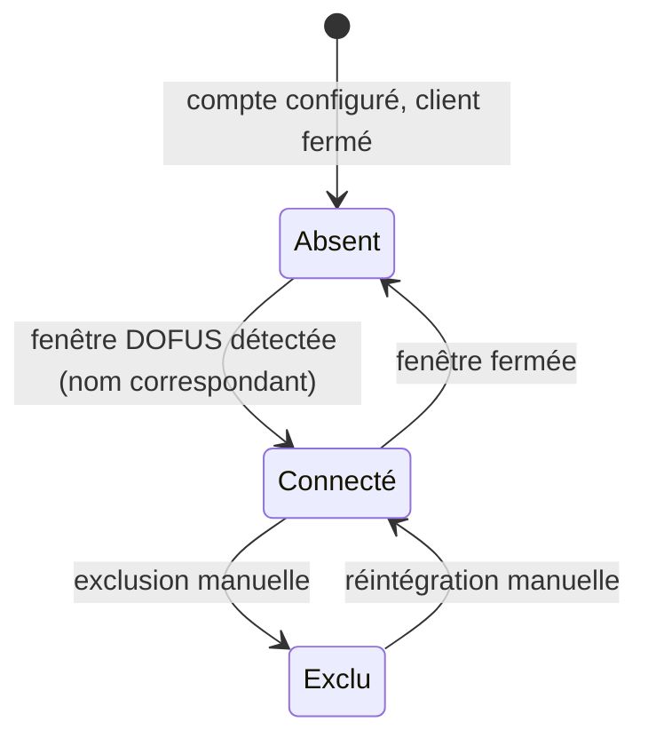

# Spec — Détection des fenêtres & gestion des comptes

**Domaine :** détection · **Profil sécurité :** minimal · **UI :** Oui
**Archi active :** `docs/agent/archis/ARCHI-DOTNET-WPF.md`
**Couvre :** EF-01, EF-02, EF-03, EF-09, H-01 · **Voir aussi :** `overview.md`, `switching.md`

---

## 2.4 User Stories

### US-D01 — Détecter les clients DOFUS ouverts

**En tant que** joueur, **je veux** que l'outil détecte automatiquement les
fenêtres des clients DOFUS ouvertes **afin de** ne pas les déclarer à la main.

**Critères d'acceptation :**
```gherkin
Given deux clients DOFUS ouverts
When l'outil observe les fenêtres du bureau
Then chaque client apparaît comme un compte détecté
And chaque compte est identifié par le nom du personnage extrait du titre
```
**Priorité :** Must (EF-01, H-01)

### US-D02 — Afficher l'état des comptes en temps réel

**En tant que** joueur, **je veux** voir la liste des comptes avec leur état
(connecté / absent) mise à jour en temps réel **afin de** savoir ce qui est
disponible.

**Critères d'acceptation :**
```gherkin
Given un compte configuré dont le client est fermé
When j'ouvre le client de ce compte
Then le compte passe de « absent » à « connecté » sans action manuelle
When je ferme un client
Then le compte correspondant passe à « absent » sans erreur
```
**Priorité :** Must (EF-02, CA-03)

### US-D03 — Définir et réordonner l'ordre de rotation

**En tant que** joueur, **je veux** définir et réordonner l'ordre de rotation des
comptes **afin de** contrôler la séquence de bascule.

**Critères d'acceptation :**
```gherkin
Given trois comptes configurés
When je déplace le troisième compte en première position
Then l'ordre de rotation reflète immédiatement le nouvel arrangement
And l'ordre est persistant (voir persistence.md)
```
**Priorité :** Must (EF-03)

### US-D04 — Exclure temporairement un compte

**En tant que** joueur, **je veux** exclure un compte de la rotation sans le
supprimer **afin de** le réintégrer plus tard sans reconfigurer.

**Critères d'acceptation :**
```gherkin
Given un compte présent dans l'ordre de rotation
When je l'exclus temporairement
Then il est ignoré par la bascule « suivant / précédent »
And il reste visible et réactivable dans la configuration
```
**Priorité :** Could (EF-09)

---

## 2.5 Règles de gestion

| ID | Règle | Priorité | Source |
|---|---|---|---|
| RG-D01 | Un compte est identifié par le nom de personnage extrait du titre de la fenêtre (H-01). | Must | US-D01 |
| RG-D02 | L'état d'un compte est `connecté` si sa fenêtre existe, sinon `absent`. | Must | US-D02 |
| RG-D03 | Un compte configuré est conservé même absent (voir EP-03). | Must | US-D02 |
| RG-D04 | Un compte exclu reste dans la configuration mais est retiré de la rotation. | Could | US-D04 |
| RG-D05 | La détection est **événementielle** (pas de polling actif) pour tenir ENF-003. | Should | ENF-003 |

## 2.6 Flux — cycle de vie d'un compte



---

## 3.x Notes techniques (normatif : archi §Interop)

- Énumération initiale : `EnumWindows` + `GetWindowText` / `GetWindowTextLength`
  (fenêtres top-level visibles). Tout le P/Invoke dans `Interop/NativeMethods.cs`.
- Suivi temps réel : `SetWinEventHook` sur `EVENT_OBJECT_CREATE`,
  `EVENT_OBJECT_DESTROY`, `EVENT_OBJECT_NAMECHANGE` — évite le polling (ENF-003).
  Les callbacks arrivent hors thread UI → marshaler via `Dispatcher` (archi §Threading).
- **Critère « fenêtre DOFUS » (PO-001 tranché) :** reconnaissance **exclusivement
  via les API fenêtres `user32`** — motif de titre et/ou classe de fenêtre
  (`GetClassName`). **Aucune inspection du processus** (pas de `GetWindowThreadProcessId`
  + lookup, pas d'`OpenProcess`) : conforme à C-02 (« seules les API de gestion
  des fenêtres… de user32 »). Isoler le critère derrière une méthode dédiée,
  testable. *(Contexte : plusieurs processus `Dofus.exe` coexistent, chacun avec un
  sous-processus au nom distinct ; non requis ici car le titre porte l'identité — H-01.)*
- Extraction du nom de personnage : fonction pure `string → string?` testable
  indépendamment (couvre le risque de changement de format de titre).
- Le service expose une interface (`IWindowDetector`) émettant des événements
  `AccountAppeared` / `AccountDisappeared` ; il ne connaît ni ViewModel ni UI.
