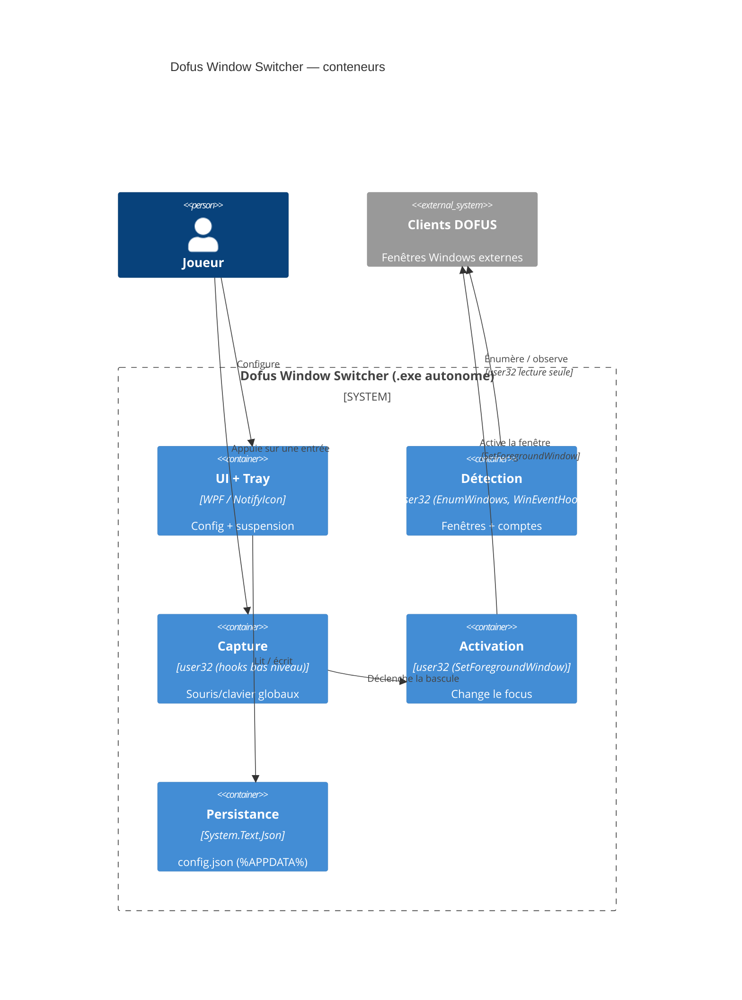

# Spécifications & Cadrage — Dofus Window Switcher

**Version :** 0.1 · **Date :** 2026-09-24 · **Statut :** Brouillon
**Profil sécurité :** minimal · **Interface utilisateur :** Oui
**Archi active :** `docs/agent/archis/ARCHI-DOTNET-WPF.md`

> **Spec principale** : cadrage global + technique transverse. Détails par domaine
> dans `detection.md`, `switching.md`, `persistence.md`, `tray.md` (voir `_index.md`).
> Source : `docs/init/expression-de-besoin-dofus-switcher.md` (v0.2).

| Version | Date | Modifications |
|---|---|---|
| 0.1 | 2026-09-24 | Cadrage initial depuis l'expression de besoin v0.2 |

---

# 1 — CADRAGE

## 1.1 Contexte & Objectifs

**Problème :** un joueur fait tourner plusieurs clients DOFUS en parallèle sous
Windows ; basculer via Alt+Tab / Alt+Échap est lent et l'ordre se mêle aux autres
applications.

**Objectifs mesurables :**
1. Basculer vers un client DOFUS voisin en **< 100 ms** après l'appui (ENF-002).
2. Parcourir N clients ouverts dans un **ordre défini par l'utilisateur**, comptes
   absents ignorés (CA-01, CA-03).
3. **Zéro interaction** avec le processus DOFUS : uniquement API fenêtres et hooks
   d'entrée globaux de `user32` (C-02, C-03).

## 1.2 Périmètre

**Inclus :** détection des fenêtres DOFUS, bascule cyclique et directe, interface
de configuration (ordre, associations, exclusions), persistance locale, présence
en zone de notification.
**Exclus :** toute interaction avec le contenu du jeu — envoi de touches/clics,
lecture mémoire, lecture réseau, automatisation.

## 1.3 Contraintes

| Type | Description |
|---|---|
| Technique | .NET 10 + WPF, **zéro NuGet**, exécutable autonome single-file (voir archi). Windows 10/11 x64. |
| C-02 | Interaction OS seule (`user32`, fenêtres + hooks). Jamais de handle process DOFUS, mémoire, injection ni réseau. |
| C-03 | Aucune entrée synthétique (`SendInput`/`PostMessage`/`SendMessage`), même pour forcer le focus. |
| Réglementaire | RGPD sans objet : aucune donnée personnelle, aucun réseau. |

## 1.4 Hypothèses & Risques

**H-01 (confirmée) :** le titre de fenêtre du client DOFUS 3 contient le nom du
personnage — clé d'identification des comptes.

| Risque | Prob. | Impact | Mitigation |
|---|---|---|---|
| R-01 — Ankama opposé aux logiciels tiers ; risque de sanction | M | É | Assumé par l'utilisateur ; C-02/C-03 réduisent la surface, sans garantie. |
| `SetForegroundWindow` refusé par Windows | M | M | `user32` non synthétique (`AttachThreadInput`) — voir `switching.md`. |
| Format du titre DOFUS modifié par une MàJ | F | M | Extraction du nom isolée derrière une fonction pure testable. |

> Qualité ISO 25010 : voir les ENF-001..006 (§2.3) et §3.6.

---

# 2 — SPÉCIFICATIONS FONCTIONNELLES

## 2.1 Vue d'ensemble & acteurs

Outil desktop mono-utilisateur, local, sans compte ni réseau, tournant en tâche de
fond (tray). Il observe les fenêtres DOFUS et convertit des entrées physiques
configurables en changements de focus. Une fenêtre de config gère ordre,
associations et exclusions.

| Acteur | Rôle |
|---|---|
| Joueur | Unique utilisateur : configure et utilise la bascule. |
| Clients DOFUS | Fenêtres externes observées et activées ; jamais modifiées. |
| Windows | Fournit les API fenêtres et hooks d'entrée (`user32`). |

## 2.3 Exigences non-fonctionnelles

| ID | Caractéristique | Cible mesurable | Ref. recette |
|---|---|---|---|
| ENF-001 | Compatibilité | Windows 10 et 11, x64 | RT-COMPAT-001 |
| ENF-002 | Latence | Appui → activation < 100 ms | RT-PERF-001 |
| ENF-003 | Empreinte au repos | CPU ~0 %, < 100 Mo RAM | RT-PERF-002 |
| ENF-004 | Zone de notification | Fonctionne réduit ; démarrage Windows optionnel | RT-TRAY-001 |
| ENF-005 | Privilèges | Sans élévation, sauf clients DOFUS en admin | RT-PRIV-001 |
| ENF-006 | Architecture | Couches séparées : détection, capture, activation, persistance, UI | Revue de code |

---

# 3 — SPÉCIFICATIONS TECHNIQUES

## 3.1 Architecture (C4 Container)

## 3.2 Stack technique

| Composant | Technologie | Justification |
|---|---|---|
| Runtime / UI | .NET 10 (LTS) + WPF | LTS, natif Windows, zéro dépendance |
| Pattern | MVVM manuel léger | Découplage couches/UI, testabilité (ENF-006) |
| Interop | P/Invoke Win32 (`[LibraryImport]`) | Détection, hooks, activation `user32` |
| Persistance | `System.Text.Json` (source-gen) | Fichier lisible local, in-box |
| Tray | `NotifyIcon` (WinForms in-box) | Zone de notification sans NuGet |
| Packaging | Publish single-file self-contained | Un `.exe`, aucun runtime préinstallé |
| Tests | xUnit (projet séparé, dev-only) | ViewModels + services hors UI |

**Références d'architecture :** `docs/agent/archis/ARCHI-DOTNET-WPF.md` — normatif
(structure repo, MVVM manuel, interop `NativeMethods`, persistance JSON, tray,
threading Dispatcher, publication single-file, règles de constantes).

## 3.6 / 3.8 Qualité détaillée & tests

| Exigence | Cible | Ref. |
|---|---|---|
| Latence appui → focus | < 100 ms (4 clients) | ENF-002 |
| RAM / CPU au repos | < 100 Mo / ~0 % (détection événementielle) | ENF-003 |
| Tests unitaires | Rotation, parsing titre, sérialisation, conflits | ENF-006 |
| Tests intégration | Capture → activation (interop mocké) | — |
| Recette manuelle | Hooks globaux, activation réelle, tray | — |

## 3.7 Sécurité — Socle (profil minimal)

Application locale, **sans réseau, sans compte, sans serveur** : Auth/TLS/injection
SQL/headers HTTP **sans objet**.

| Domaine | Exigence |
|---|---|
| Secrets | Aucun ; pas d'`.env`. |
| Validation | Config JSON validée au chargement ; corrompue → défaut + backup (EP-04). |
| Fichiers | Config non sensible dans `%APPDATA%\DofusSwitcher\` ; écriture atomique. |
| Non-intrusion | Aucun accès au processus DOFUS (C-02) ; aucune entrée synthétique (C-03). |

> §3.2/§3.3 validés et l'app ayant une UI : lancer la phase **UI Design**
> (`TEMPLATE-UI-DESIGN.md`) avant le plan des Axes → `docs/ui-design.md`. Le modèle
> de données complet ira dans `docs/data-model.md` (esquisse dans `persistence.md`).

---

# 4 — TRAÇABILITÉ

| ID | Description | Domaine | Recette | Statut |
|---|---|---|---|---|
| EF-01..03, 09 | Détection, liste, ordre, exclusion | `detection.md` | RT-DET-* | — |
| EF-04..08 | Capture d'entrées & bascule | `switching.md` | RT-SW-* | — |
| EP-01..05 | Persistance config | `persistence.md` | RT-PERS-* | — |
| EF-10, ENF-004 | Tray & cycle de vie | `tray.md` | RT-TRAY-* | — |
| CA-01..04 | Critères d'acceptation | tous | RT-CA-* | — |

**Points ouverts :** _(aucun ouvert)_ · PO-001 **tranché** : reconnaissance
DOFUS via API fenêtres `user32` uniquement (titre/classe), sans inspection du
processus (C-02) — voir `detection.md`. · PO-002 **tranché** : lancement manuel,
app listée dans les applications Windows (raccourci menu Démarrer), pas d'auto-
démarrage par défaut — voir `tray.md`.

**Go / No-go :** Go ☐ No-go ☐ — Commentaire :
