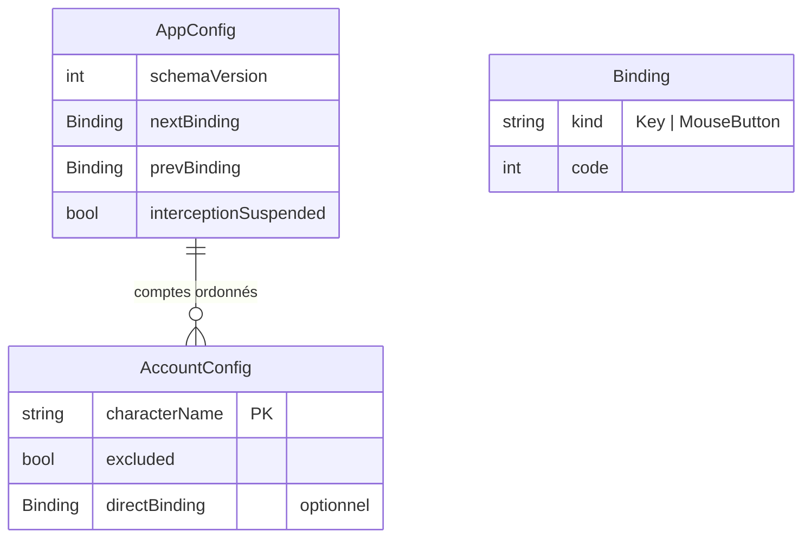

# Spec — Persistance de la configuration

**Domaine :** persistence · **Profil sécurité :** minimal · **UI :** Oui
**Archi active :** `docs/agent/archis/ARCHI-DOTNET-WPF.md`
**Couvre :** EP-01..EP-05, CA-04 · **Voir aussi :** `overview.md`, `detection.md`, `switching.md`

---

## 2.4 User Stories

### US-P01 — Sauvegarder et recharger la configuration

**En tant que** joueur, **je veux** que ma configuration (ordre, associations,
exclusions) soit sauvegardée automatiquement et rechargée au démarrage **afin de**
retrouver mon paramétrage sans le refaire.

**Critères d'acceptation :**
```gherkin
Given une configuration (ordre + associations) définie
When je modifie l'ordre puis je redémarre l'application
Then l'ordre et les associations sont identiques à avant le redémarrage        # CA-04
```
**Priorité :** Must (EP-01, EP-02)

### US-P02 — Conserver les comptes hors ligne

**En tant que** joueur, **je veux** qu'un compte configuré reste connu même quand
son client n'est pas lancé **afin de** ne pas perdre sa place et ses associations.

**Critères d'acceptation :**
```gherkin
Given un compte configuré avec une entrée dédiée
When son client est fermé puis rouvert
Then le compte reprend sa place et son association d'origine                    # CA-03
```
**Priorité :** Must (EP-03)

### US-P03 — Résister à une configuration corrompue

**En tant que** joueur, **je veux** que l'application démarre même si le fichier
de configuration est corrompu **afin de** ne jamais être bloqué.

**Critères d'acceptation :**
```gherkin
Given un fichier config.json corrompu
When je démarre l'application
Then elle démarre avec une configuration vide
And une copie du fichier fautif est conservée
```
**Priorité :** Should (EP-04)

### US-P04 — Exporter / importer la configuration

**En tant que** joueur, **je veux** exporter et importer ma configuration **afin
de** la sauvegarder ou la transférer.

**Priorité :** Could (EP-05)

---

## 2.5 Règles de gestion

| ID | Règle | Priorité | Source |
|---|---|---|---|
| RG-P01 | La config est un **fichier lisible** (JSON indenté) dans `%APPDATA%\DofusSwitcher\config.json`. | Must | EP-01 |
| RG-P02 | Toute modification déclenche une sauvegarde automatique (débouncée). | Must | EP-02 |
| RG-P03 | La config est rechargée au démarrage ; absente → configuration vide par défaut. | Must | EP-02 |
| RG-P04 | Un compte est conservé même absent ; identité stable par nom de personnage. | Must | EP-03 |
| RG-P05 | Écriture **atomique** (fichier temporaire + remplacement) — jamais de fichier tronqué. | Must | Fiabilité |
| RG-P06 | Fichier illisible/corrompu → copie `*.corrupt-<horodatage>` puis config vide, sans crash. | Should | EP-04 |
| RG-P07 | Export/import via boîte de dialogue de fichier ; même schéma que le fichier interne. | Could | EP-05 |

## 2.7 Hors périmètre

- Chiffrement de la config (données non sensibles — profil minimal).
- Synchronisation cloud / multi-postes.

---

## 3.3 Modèle de données (esquisse — détail dans `docs/data-model.md`)



## 3.x Notes techniques (normatif : archi §Persistance)

- `System.Text.Json` avec `JsonSerializerContext` source-gen (`AppJsonContext`) —
  pas de réflexion dynamique, compatible single-file.
- `IConfigStore` : `Load()` / `Save(AppConfig)`. Écriture atomique (temp +
  `File.Move` overwrite). Sauvegarde **débouncée** via `DispatcherTimer`
  (archi §Threading) pour ne pas écrire à chaque frappe.
- `schemaVersion` prévu dès le départ pour migrer le format sans casser les
  configs existantes.
- L'identité d'un compte est le nom de personnage (clé) → cohérent avec la
  détection (RG-D01) et la conservation hors ligne (EP-03).
