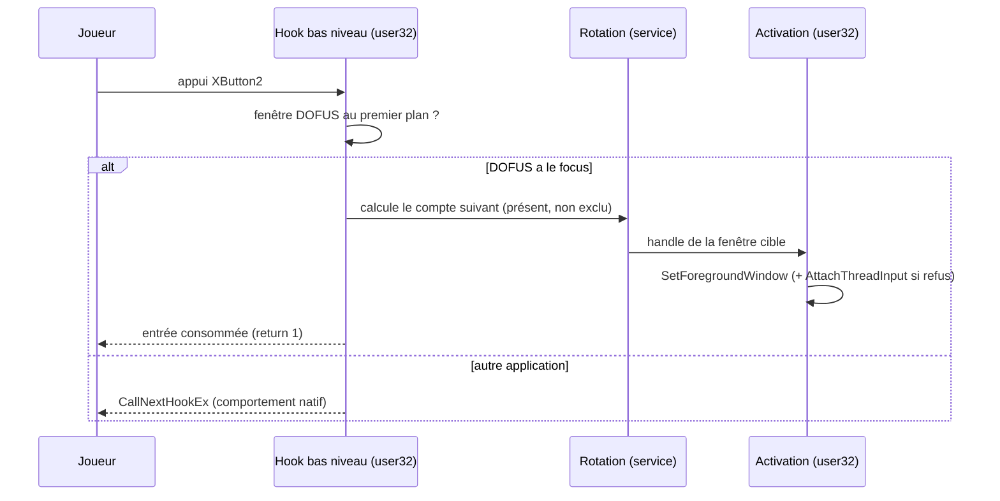

# Spec — Capture d'entrées & bascule de focus

**Domaine :** switching (cœur) · **Profil sécurité :** minimal · **UI :** Oui
**Archi active :** `docs/agent/archis/ARCHI-DOTNET-WPF.md`
**Couvre :** EF-04..EF-08, C-01, C-02, C-03, ENF-002, CA-01, CA-02 · **Voir aussi :** `overview.md`, `detection.md`

---

## Définitions

Une **entrée** est une touche clavier **ou** un bouton souris **unique**. Les
combinaisons (modificateur + touche, accords) sont exclues (D-01).

---

## 2.4 User Stories

### US-S01 — Bascule cyclique suivant / précédent

**En tant que** joueur, **je veux** une entrée « suivant » et une entrée
« précédent » (par défaut XButton2 / XButton1) **afin de** activer le compte
adjacent dans l'ordre de rotation, en ignorant les comptes absents.

**Critères d'acceptation :**
```gherkin
Given 4 clients ouverts et un ordre configuré
When j'appuie 4 fois sur « suivant »
Then les 4 comptes sont parcourus dans l'ordre et le focus revient au premier   # CA-01
Given un compte absent au milieu de l'ordre
When j'appuie sur « suivant »
Then le compte absent est ignoré et le suivant présent reçoit le focus          # CA-03
```
**Priorité :** Must (EF-04)

### US-S02 — Activation directe d'un compte

**En tant que** joueur, **je veux** associer une entrée dédiée à un compte précis
**afin de** activer directement sa fenêtre.

**Critères d'acceptation :**
```gherkin
Given une entrée associée au compte "Perso-B"
When j'appuie sur cette entrée pendant qu'un client DOFUS a le focus
Then la fenêtre de "Perso-B" est activée
```
**Priorité :** Should (EF-05)

### US-S03 — Interception conditionnée au focus DOFUS

**En tant que** joueur, **je veux** que l'outil n'intercepte une entrée que si une
fenêtre DOFUS a le focus **afin de** garder le comportement natif ailleurs.

**Critères d'acceptation :**
```gherkin
Given un navigateur au premier plan
When j'appuie sur le bouton souris « précédent »
Then le navigateur garde son comportement natif (page précédente)              # CA-02
Given un client DOFUS au premier plan
When j'appuie sur une entrée associée
Then l'entrée est consommée et produit uniquement un changement de focus        # C-01
```
**Priorité :** Must (EF-07, C-01)

### US-S04 — Configurer les associations par capture

**En tant que** joueur, **je veux** voir et modifier toutes les associations
depuis l'interface, l'assignation se faisant par capture (« appuyez sur un
bouton ») **afin de** paramétrer sans connaître les codes de touches.

**Priorité :** Must (EF-06)

### US-S05 — Signaler les conflits d'association

**En tant que** joueur, **je veux** être averti quand une même entrée est
assignée à deux actions **afin de** corriger l'ambiguïté.

**Priorité :** Should (EF-08)

---

## 2.5 Règles de gestion

| ID | Règle | Priorité | Source |
|---|---|---|---|
| RG-S01 | Une entrée interceptée quand un client DOFUS a le focus produit **exactement un** changement de focus, et rien d'autre (C-01). | Must | US-S03 |
| RG-S02 | Hors focus DOFUS, toute entrée est transmise nativement (`CallNextHookEx`). | Must | US-S03 |
| RG-S03 | La bascule « suivant/précédent » ignore les comptes absents et exclus, et est cyclique. | Must | US-S01 |
| RG-S04 | Défauts : « suivant » = XButton2, « précédent » = XButton1. | Must | EF-04 |
| RG-S05 | Une entrée déjà assignée à une autre action est signalée comme conflit avant enregistrement. | Should | US-S05 |
| RG-S06 | Latence appui → activation < 100 ms (ENF-002) : le callback du hook reste minimal. | Must | ENF-002 |

## 2.6 Séquence critique — appui « suivant »



---

## 3.x Notes techniques (normatif : archi §Interop, §Threading)

- Capture : hooks bas niveau `WH_MOUSE_LL` + `WH_KEYBOARD_LL` via
  `SetWindowsHookEx` — seul moyen de capter XButton1/2 et les touches globalement
  **sans élévation** (ENF-005). Tout dans `Interop/NativeMethods.cs`.
- **C-03 (absolu) :** ne jamais appeler `SendInput`/`PostMessage`/`SendMessage`
  d'entrée, même pour forcer le focus. L'entrée synthétique atterrirait dans le
  client DOFUS actif.
- Activation : `SetForegroundWindow`. Si Windows refuse le focus (limitation
  connue), recourir à `AttachThreadInput` (API de gestion de file d'entrée,
  `user32`, non synthétique, conforme C-02/C-03), puis détacher. `[WARN]` à
  documenter dans le code.
- **C-02 (absolu) :** ne jamais ouvrir de handle sur le *processus* DOFUS
  (`OpenProcess`), lire sa mémoire, l'injecter ni intercepter son réseau. Seules
  les API *fenêtres* sont permises (handles de fenêtre `HWND`, pas de handle process).
- Le callback du hook doit être **le plus court possible** (RG-S06) : décision +
  activation synchrone ou republication immédiate ; jamais d'I/O disque dedans.
- Découplage : `IInputHook` (capture) → `ISwitchController` (décision rotation) →
  `IWindowActivator` (focus). Aucun ne référence l'UI ; la logique de rotation est
  une classe pure testable (CA-01 en test unitaire).
- Algorithme de rotation cyclique avec saut des absents/exclus : à détailler dans
  `docs/algos/rotation.md` lors de l'Axe correspondant (`[ALGO]`).
