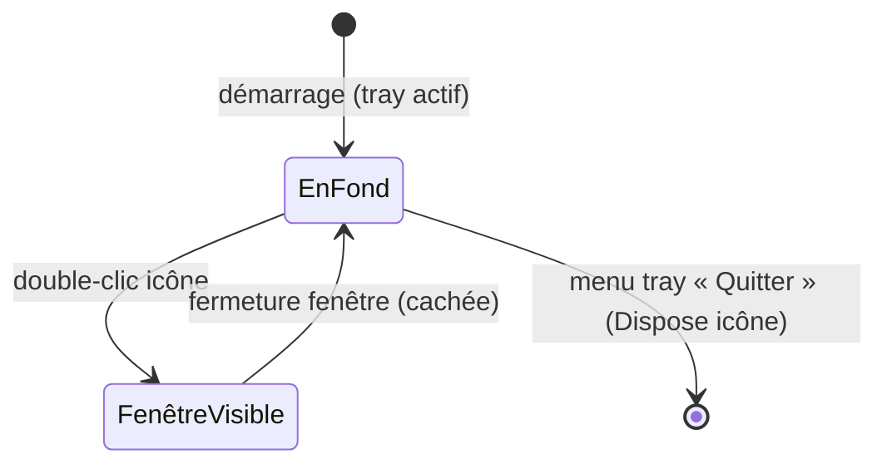

# Spec — Zone de notification & cycle de vie

**Domaine :** tray · **Profil sécurité :** minimal · **UI :** Oui
**Archi active :** `docs/agent/archis/ARCHI-DOTNET-WPF.md`
**Couvre :** EF-10, ENF-004 · **Voir aussi :** `overview.md`, `switching.md`

---

## 2.4 User Stories

### US-T01 — Vivre dans la zone de notification

**En tant que** joueur, **je veux** que l'application fonctionne réduite dans la
zone de notification **afin de** la garder active sans encombrer la barre des
tâches.

**Critères d'acceptation :**
```gherkin
Given l'application lancée
When je ferme la fenêtre de configuration
Then l'application continue de tourner et reste accessible via l'icône du tray
When je double-clique l'icône du tray
Then la fenêtre de configuration réapparaît
```
**Priorité :** Should (ENF-004)

### US-T02 — Suspendre / réactiver l'interception

**En tant que** joueur, **je veux** suspendre ou réactiver globalement
l'interception depuis l'icône du tray **afin de** rendre temporairement leur
comportement natif à toutes les entrées.

**Critères d'acceptation :**
```gherkin
Given l'interception active
When je choisis « Suspendre » dans le menu du tray
Then aucune entrée n'est plus interceptée (comportement natif partout)
And l'icône reflète l'état suspendu
When je choisis « Réactiver »
Then la bascule fonctionne de nouveau
```
**Priorité :** Should (EF-10)

### US-T03 — Lancement manuel, découvrable dans Windows

**En tant que** joueur, **je veux** lancer l'outil manuellement depuis la liste
des applications Windows (menu Démarrer) **afin de** le retrouver comme une
application normale, sans démarrage automatique imposé.

**Critères d'acceptation :**
```gherkin
Given l'outil installé
When j'ouvre le menu Démarrer et je recherche son nom
Then il apparaît dans la liste des applications et se lance au clic
And il ne démarre pas automatiquement avec Windows (aucun réglage par défaut)
```
**Priorité :** Should (ENF-004, PO-002)

### US-T04 — Démarrage automatique (option, désactivée par défaut)

**En tant que** joueur, **je veux** pouvoir *optionnellement* activer le démarrage
avec Windows **afin de** ne pas relancer l'outil à chaque session.

**Priorité :** Could (ENF-004)

---

## 2.5 Règles de gestion

| ID | Règle | Priorité | Source |
|---|---|---|---|
| RG-T01 | Fermer la fenêtre la **cache** (ne quitte pas l'app) ; la sortie réelle passe par le menu du tray. | Should | US-T01 |
| RG-T02 | L'état « interception suspendue » est reflété visuellement (icône/menu) et persistant. | Should | US-T02 |
| RG-T03 | En état suspendu, le hook transmet toujours l'entrée nativement (`CallNextHookEx`). | Should | US-T02 |
| RG-T04 | Lancement manuel ; l'app est listée dans les applications Windows (raccourci menu Démarrer). Aucun démarrage automatique par défaut. | Should | US-T03 |
| RG-T05 | Démarrage avec Windows : option désactivée par défaut, activable depuis la configuration. | Could | US-T04 |
| RG-T06 | À la sortie, l'icône du tray est libérée (`Dispose`) — pas d'icône fantôme. | Must | Fiabilité |

## 2.6 Flux — cycle de vie fenêtre / app



---

## 3.x Notes techniques (normatif : archi §Tray, §Composition root)

- `NotifyIcon` (WinForms in-box, `UseWindowsForms=true`) piloté par
  `TrayIconController` ; référence forte gardée par `App` (sinon GC → icône
  disparaît). `Dispose` obligatoire dans `OnExit` (RG-T05).
- `ShutdownMode.OnExplicitShutdown` : fermer la dernière fenêtre ne quitte pas
  l'app (RG-T01). Sortie réelle via le menu tray → `Application.Shutdown()`.
- L'état « suspendu » (RG-T02) est un champ de `AppConfig` (voir `persistence.md`)
  lu par le hook via l'interface du service de capture — pas de couplage UI.
- **Découvrabilité (PO-002 tranché) :** l'app est un exécutable autonome mais doit
  apparaître dans la liste des applications Windows → poser un **raccourci menu
  Démarrer** (à l'installation / premier lancement). Packaging à détailler à l'Axe
  correspondant. Lancement **manuel** ; aucun auto-démarrage par défaut.
- Option démarrage Windows (RG-T05, désactivée par défaut) : si implémentée, clé
  `HKCU\...\Run` (sans élévation, ENF-005) plutôt que dossier `Startup`.
